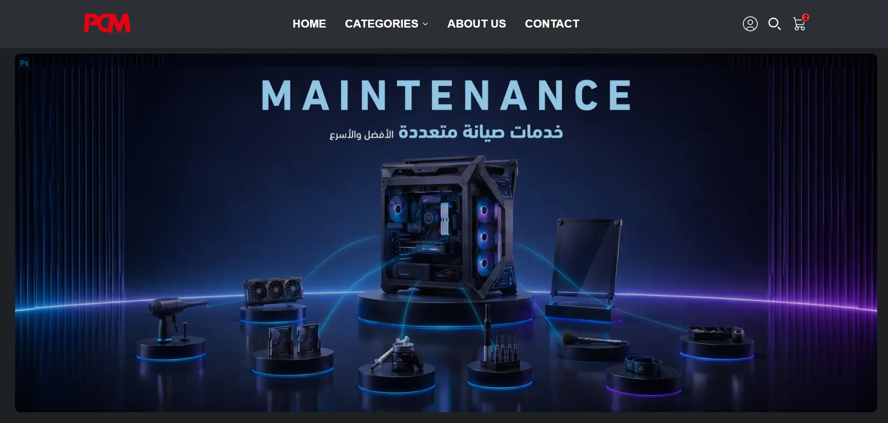
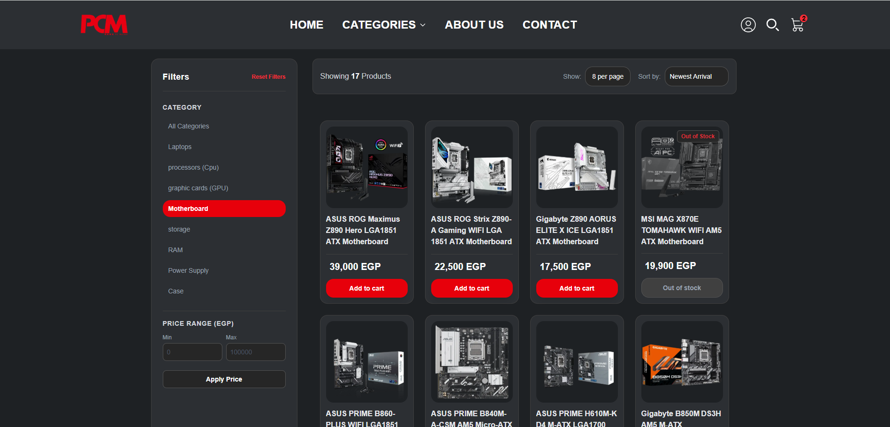
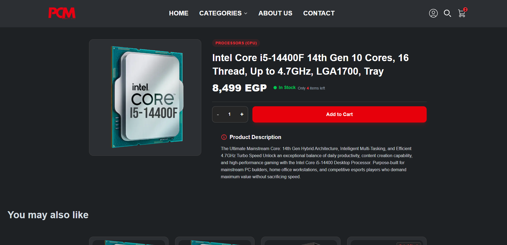
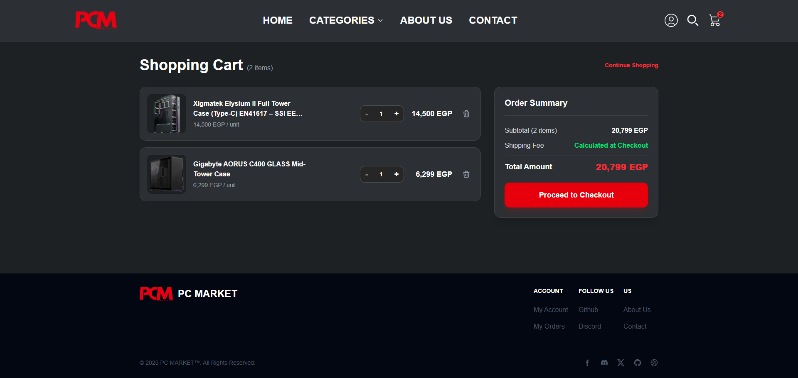
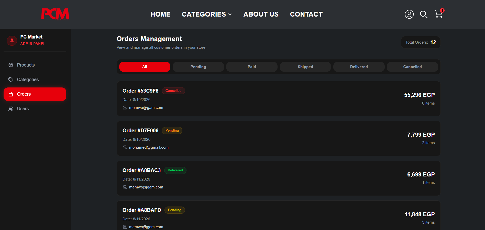

# 🖥️ PC Market - Frontend Client

A modern, responsive, and feature-rich E-Commerce frontend for **PC Market** — a specialized store for computer parts, components, and accessories. Built with **Next.js (App Router)**, **TypeScript**, and **Tailwind CSS**, integrated with a custom RESTful API.

---

## 🔗 Related Repositories

- **Backend REST API:** [PC Market Backend Repository](https://github.com/shalaby22/ecommerce-backend)
- **Live Demo:** [PC Market live demo](https://pc-market-frontend.vercel.app/)

---

## ✨ Key Features

- 🔐 **Secure Authentication System:**
  - JWT authentication managed via secure cookies (`js-cookie`).
  - Axios Interceptors automatically attach authorization headers.
  - Protected client and admin routes.

- 🛒 **Cart & Checkout Management:**
  - Persistent shopping cart state across page reloads and user sessions.
  - Cart merge functionality upon user login.
  - Seamless multi-step checkout workflow with saved user addresses.

- 📦 **Order Management & Tracking:**
  - Interactive user Order History page (`/orders`) with custom client-side pagination.
  - Dynamic status badges (`pending`, `paid`, `shipped`, `delivered`, `cancelled`).
  - Detailed single-order tracking page.

- 💻 **Product Catalog & Discovery:**
  - Dynamic filtering by category, price, and hardware attributes.
  - Smart Pagination component with custom visible range algorithm.
  - Product grid and detailed spec views.

- 👤 **User Account & Profile:**
  - User profile overview with editable user details.
  - Saved address book management.

- ⚙️ **Admin Dashboard:**
  - Dedicated administrative interface for managing inventory, products, categories, and order fulfillment.

- 🎨 **Modern Tech Aesthetic UI:**
  - Sleek dark mode design optimized for gaming and PC hardware storefronts.
  - Fully responsive across mobile, tablet, and desktop viewport.

---

## 🛠️ Tech Stack

| Category            | Technology                                          |
| :------------------ | :-------------------------------------------------- |
| **Framework**       | [Next.js](https://nextjs.org/) (App Router)         |
| **Language**        | [TypeScript](https://www.typescriptlang.org/)       |
| **Styling**         | [Tailwind CSS](https://tailwindcss.com/)            |
| **HTTP Client**     | [Axios](https://axios-http.com/)                    |
| **Cookie Handling** | [js-cookie](https://github.com/js-cookie/js-cookie) |

---

## 📸 Preview / Screenshots

### 🏠 Home Page

### 🛍️ Products Catalog

### 🔍 Product Details

### 🛒 Shopping Cart

### ⚙️ Admin Dashboard

